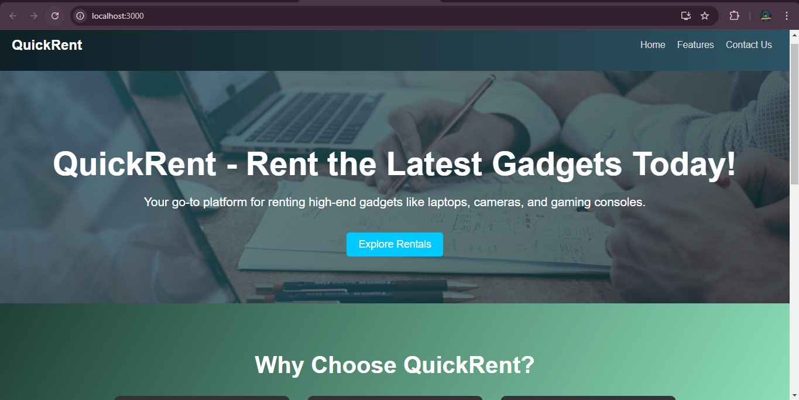
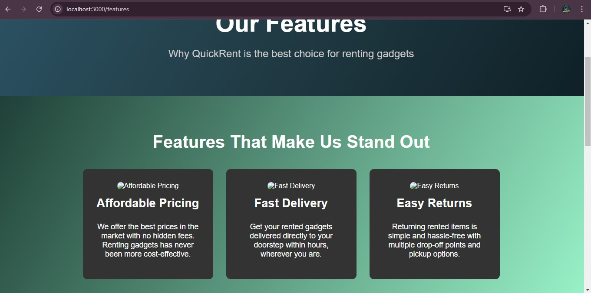
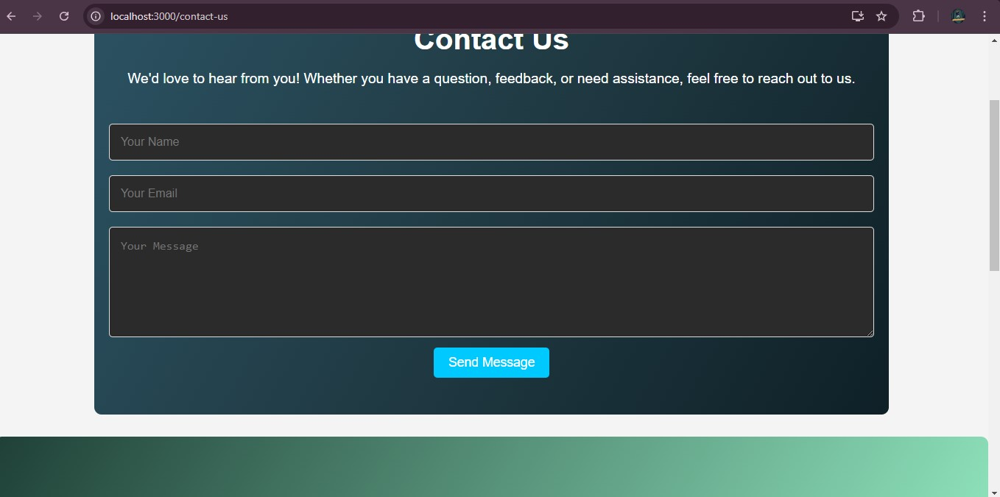

# QuickRent Landing Page

## Brief Description
QuickRent is a platform that allows users to easily rent gadgets with flexible pricing, fast delivery, and easy returns. This landing page showcases the features of the platform and provides an intuitive navigation system for users to learn more about the service.

### Approach
The landing page was built using **React.js** to create a dynamic and responsive layout. The page includes a **hero section** with a call-to-action button, **features** of the platform, and **testimonials** from satisfied users. The design follows modern UI principles with dark gradient colors, smooth hover effects, and a clean, aesthetically pleasing layout.

### Instructions to Set Up and Run the Project

1. **Clone the repository**:
   ```bash
   git clone https://github.com/shruti5655/quickrent-landing-page.git
2. **Navigate into the project folder**:
   ```bash
   cd quickrent-landing-page
3. **Install dependencies**:
   ```bash
   npm install
4. **Start the project**:
   ```bash
   npm start
## Screenshots

Here are some screenshots of the landing page:




